# 学生选课管理系统

## 项目简介
一个前端基于 Vue 3 + Element Plus，后端基于 Spring Boot + MyBatis Plus 的现代化学生选课管理系统，支持学生选课、教师管理课程和成绩、管理员统一管理等功能。

## 功能特点

- 🎨 现代化 UI 设计，支持暗色主题
- 🚀 前端基于 Vue 3 + Vite 构建，后端采用 Spring Boot 2.x
- 📱 响应式布局，支持多端适配
- 🔐 基于 Spring Security 的多角色权限管理
- 📊 数据可视化展示
- 🌈 优雅的动画和交互效果
- 💾 MyBatis Plus 提供强大的 ORM 支持
- 🔄 RESTful API 设计规范

[保留原有的开发视图 Mermaid 图]
### 项目 部分效果图

#### login 页面
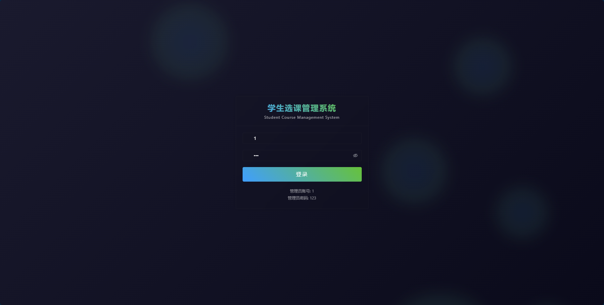
#### ADMIN系统

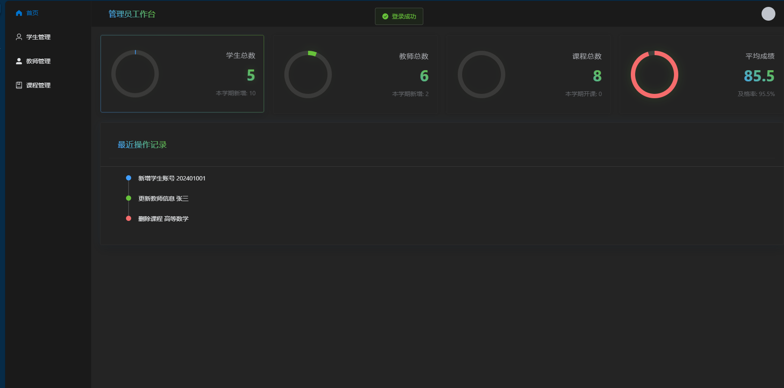

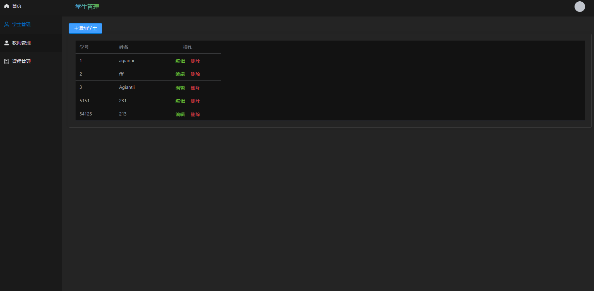

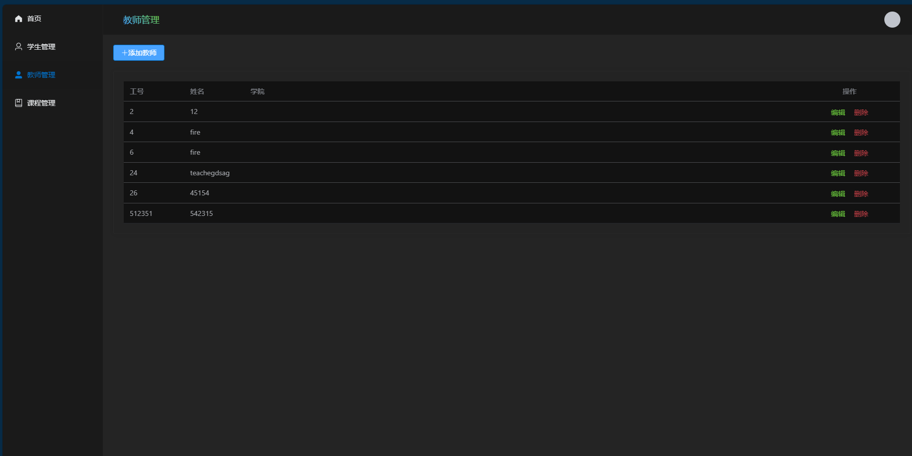

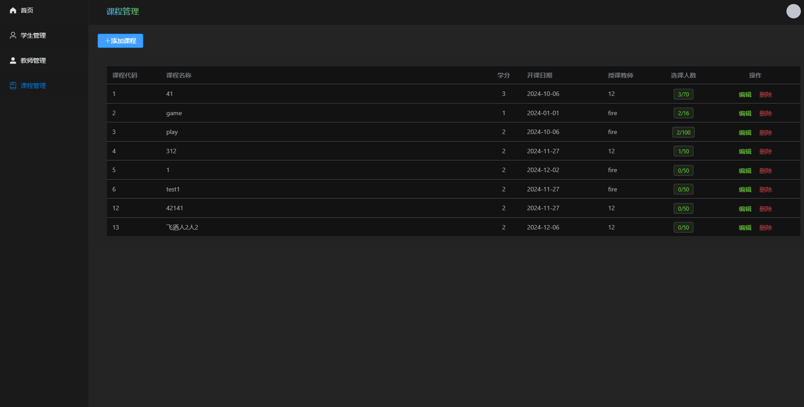

#### 学生系统
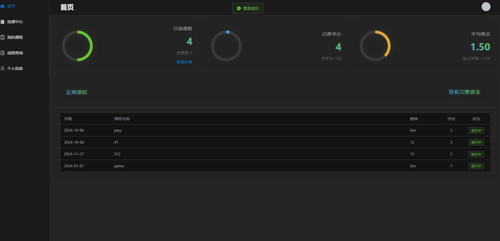
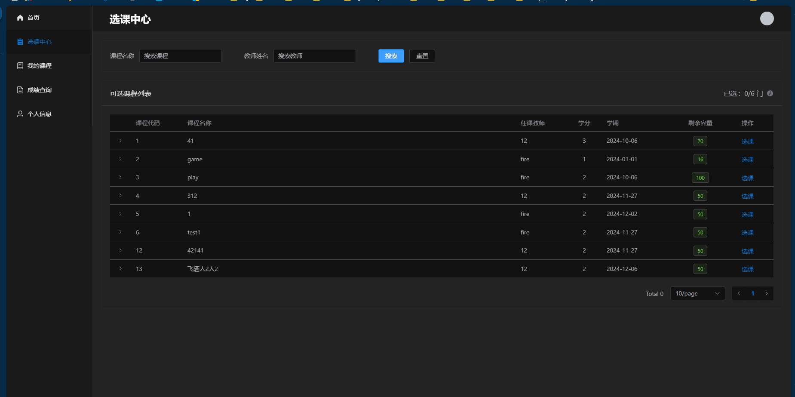
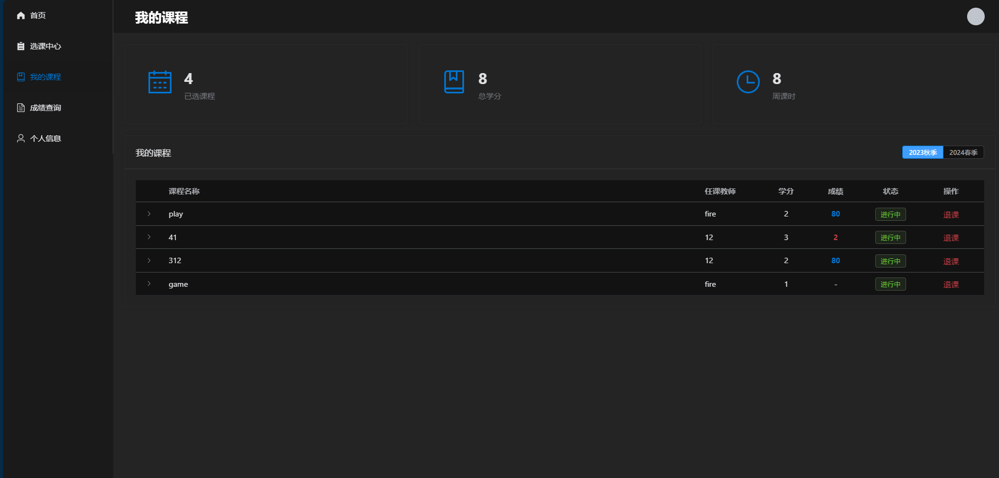
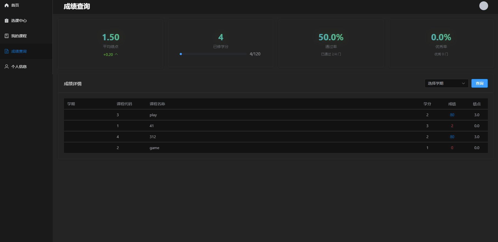
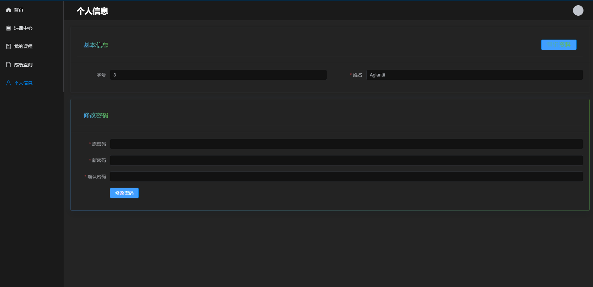

#### 教师系统

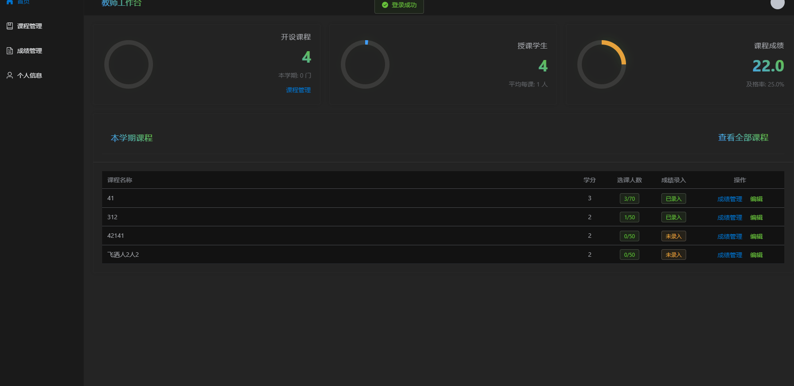
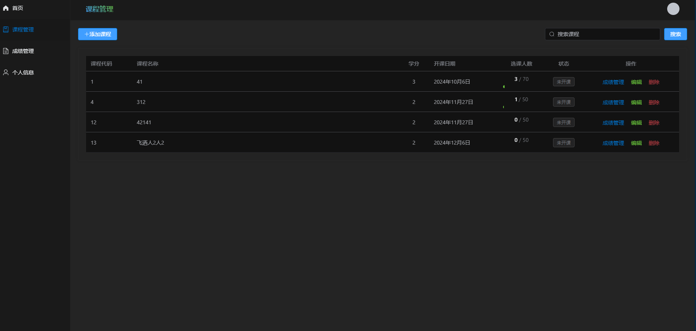
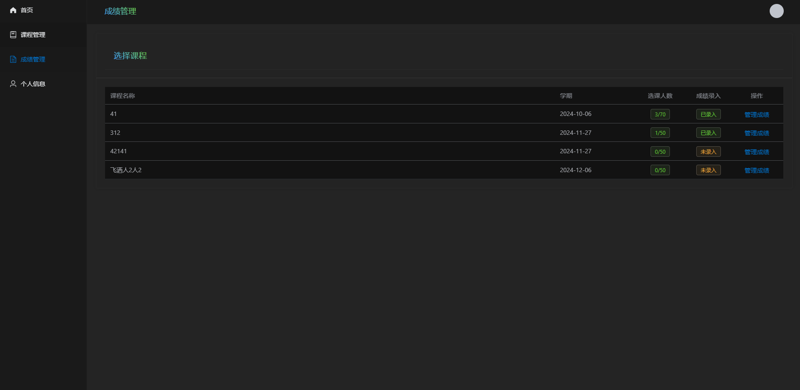
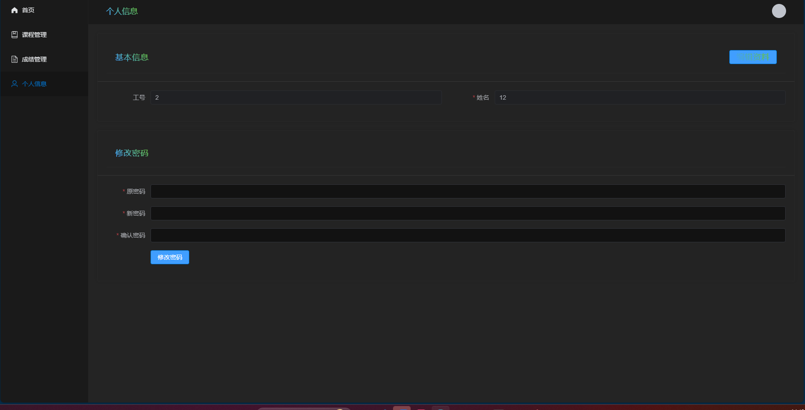
### 技术栈

#### 后端技术
- Spring Boot 2.x
- Spring Security
- MyBatis Plus
- MySQL
- Redis
- Lombok
- Swagger/Knife4j

#### 前端技术
- Vue 3
- Element Plus
- Vite
- Pinia
- Vue Router
- Axios

## 开发视图

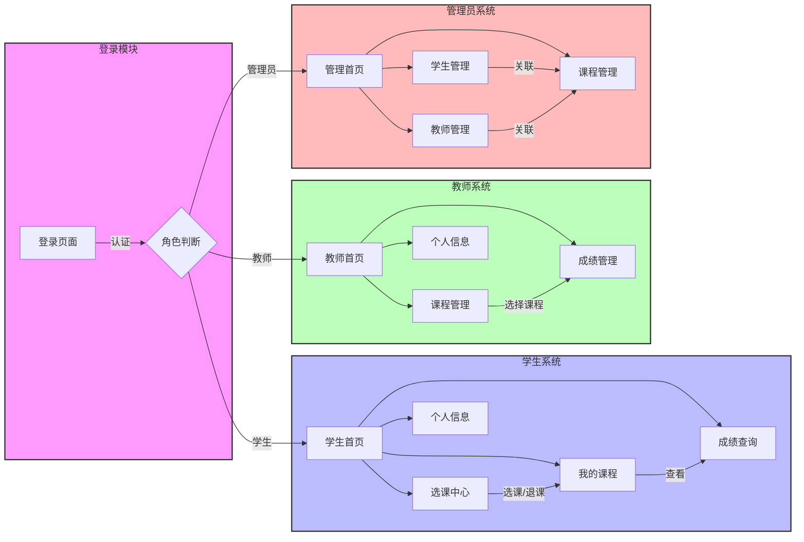

### 页面说明

#### 学生模块
- 首页：展示课程统计、学分统计等
- 选课中心：浏览和选择可用课程
- 我的课程：查看已选课程和课表
- 成绩查询：查看各科成绩和绩点

#### 教师模块
- 首页：展示教学统计和课程概况
- 课程管理：管理教授的课程
- 成绩管理：录入和修改学生成绩

#### 管理员模块
- 首页：系统整体统计和监控
- 用户管理：学生和教师账号管理
- 课程管理：全局课程设置和管理


## 系统架构

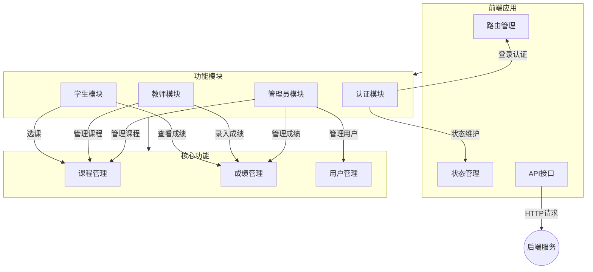


## 角色权限

| 角色   | 权限描述                     |
| ------ | ---------------------------- |
| 学生   | 选课、查看课表、查询成绩     |
| 教师   | 管理课程、录入成绩、查看统计 |
| 管理员 | 管理用户、管理课程、系统管理 |

## 环境要求
- JDK 1.8+
- Maven 3.6+
- MySQL 8.0+
- Node.js 16+

## 运行说明

### 1. 后端环境配置

#### 1.1 数据库配置
1. 创建数据库
[sql文件](./sms.sql)

2. 修改 `application.yml` 配置：
```yaml
spring:
  datasource:
    url: jdbc:mysql://localhost:3306/sms?
    useUnicode=true&characterEncoding=utf-8&serverTimezone=Asia/Shanghai
    username: your_username
    password: your_password
```


### 2. 启动项目

#### 2.1 后端启动
1. 进入后端项目根目录
```bash
cd backend
```

2. 编译项目
```bash
mvn clean package
```

3. 运行项目
```bash
java -jar target/student-course-selection.jar
```

或使用 Maven 运行：
```bash
mvn spring-boot:run
```

#### 2.2 前端启动
1. 进入前端项目目录
```bash
cd frontend
```

2. 安装依赖
```bash
npm install
```

3. 启动开发服务器
```bash
npm run dev
```

### 3. 访问项目
- 后端接口文档：http://localhost:9090/doc.html
- 前端页面：http://localhost:5173

## 项目结构

```
src/
├── main/
│   ├── java/
│   │   └── com/
│   │       └── course/
│   │           ├── config/          # 配置类
│   │           ├── controller/      # 控制器
│   │           ├── service/         # 服务层
│   │           │   └── impl/       # 服务实现
│   │           ├── mapper/          # MyBatis 接口
│   │           ├── entity/          # 实体类
│   │           ├── dto/             # 数据传输对象
│   │           ├── vo/              # 视图对象
│   │           ├── common/          # 公共类
│   │           └── util/            # 工具类
│   └── resources/
│       ├── application.yml          # 主配置文件
│       ├── application-dev.yml      # 开发环境配置
│       ├── application-prod.yml     # 生产环境配置
│       └── mapper/                  # MyBatis XML 映射文件
```

## API 文档
项目集成了 Swagger/Knife4j，启动后访问：http://localhost:9090/doc.html

## 部署说明
1. 使用 `mvn clean package` 打包后端项目
2. 使用 `npm run build` 构建前端项目
3. 配置 Nginx 代理前端静态资源和后端 API
4. 使用 `nohup` 或 `systemd` 启动后端服务


