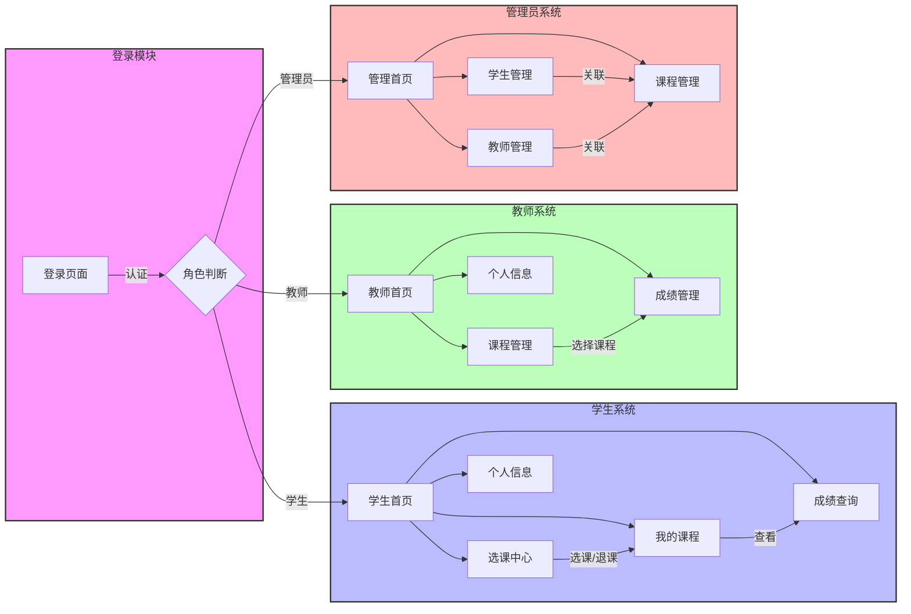
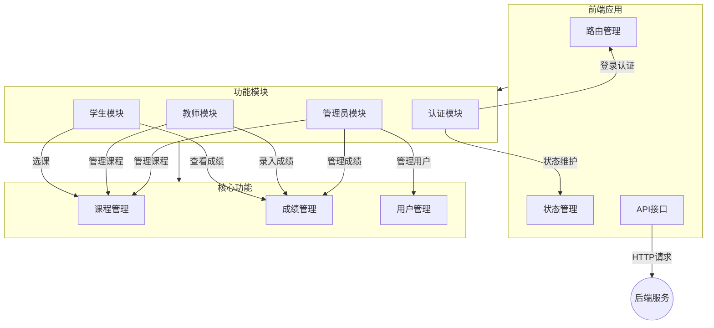

# 学生选课管理系统 (Student Course Management System)

一个基于 Vue 3 + Element Plus 的现代化学生选课管理系统，支持学生选课、教师管理课程和成绩、管理员统一管理等功能。

## 功能特点

- 🎨 现代化 UI 设计，支持暗色主题
- 🚀 前端基于 Vue 3 + Vite 构建，后端采用 Spring Boot 2.x
- 📱 响应式布局，支持多端适配
- 🔐 基于 Spring Security 的多角色权限管理
- 📊 数据可视化展示
- 🌈 优雅的动画和交互效果
- 💾 MyBatis Plus 提供强大的 ORM 支持
- 🔄 RESTful API 设计规范
## 开发视图



### 页面说明

#### 学生模块
- 首页：展示课程统计、学分统计等
- 选课中心：浏览和选择可用课程
- 我的课程：查看已选课程和课表
- 成绩查询：查看各科成绩和绩点

#### 教师模块
- 首页：展示教学统计和课程概况
- 课程管理：管理教授的课程
- 成绩管理：录入和修改学生成绩

#### 管理员模块
- 首页：系统整体统计和监控
- 用户管理：学生和教师账号管理
- 课程管理：全局课程设置和管理


## 系统架构



## 角色权限

| 角色   | 权限描述                     |
| ------ | ---------------------------- |
| 学生   | 选课、查看课表、查询成绩     |
| 教师   | 管理课程、录入成绩、查看统计 |
| 管理员 | 管理用户、管理课程、系统管理 |

## 快速开始

### 环境要求

- Node.js >= 16
- npm >= 7

### 安装依赖

```bash
npm install
```

### 开发环境运行

```bash
npm run dev
```

### 生产环境构建

```bash
npm run build
```

## 项目结构

```
src/
├── api/                # API 接口
├── assets/            # 静态资源
├── components/        # 公共组件
├── layouts/           # 布局组件
├── router/            # 路由配置
├── styles/            # 全局样式
├── views/             # 页面组件
│   ├── login/        # 登录页面
│   ├── admin/        # 管理员页面
│   ├── teacher/      # 教师页面
│   ├── student/      # 学生页面
│   └── error/        # 错误页面
└── App.vue           # 根组件
```

## 技术栈

- Vue 3
- Vite
- Element Plus
- Vue Router
- Axios
- Sass

## 开发规范

- 组件命名：大驼峰命名法（PascalCase）
- 文件命名：kebab-case
- CSS 类命名：BEM 命名规范
- Git 提交：遵循 Conventional Commits

## 示例账号

- 管理员
  - 账号：1
  - 密码：123

## 浏览器支持

- Chrome >= 87
- Firefox >= 78
- Safari >= 14
- Edge >= 88

## 贡献指南

1. Fork 本仓库
2. 创建特性分支
3. 提交更改
4. 推送到分支
5. 创建 Pull Request

